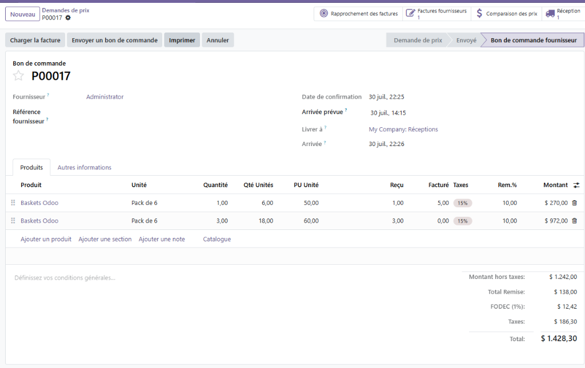
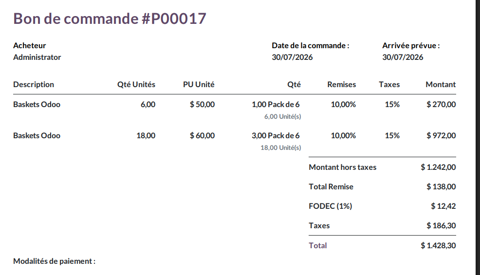

# 📦 SAH Lilas Distribution - Gestion Avancée des Conditionnements & Totaux

## 📖 À propos

**SAH Lilas Distribution** est un module Odoo 19 sur-mesure dont l'objectif est d'optimiser l'expérience utilisateur et la fiabilité des données dans un environnement de vente et distribution. 
Il apporte deux grands axes d'améliorations :
1. **Une lecture sans erreur des quantités et prix** : Affiche automatiquement les quantités réelles en Unités de base, peu importe l'emballage sélectionné (Pack, Carton).
2. **Une transparence des totaux financiers** : Affiche systématiquement le Total des Remises accordées et la taxe FODEC (1%) au bas de tous les documents commerciaux.

Tout ceci en respectant la règle d'or du projet : **Simple et 100% Natif**.

---

## ✨ Fonctionnalités Principales

### 1. 🔄 Conversion Dynamique & Édition (Lignes de documents)
* **Colonnes `Qté Unités` et `PU Unité`** : Le système convertit la quantité et calcule le prix réel à l'unité de base de l'article en temps réel, évitant tout calcul mental.
* **Édition Intuitive (On-the-fly)** : Le champ `PU Unité` est **100% modifiable**. En tapant un prix à l'unité, le module recalcule automatiquement (via fonction inverse) le prix du conditionnement global. Résultat : le sous-total de la ligne et les taxes se mettent à jour instantanément à l'écran sans aucun rafraîchissement manuel !
* **Épuration de l'interface** : La colonne standard "Prix unitaire" d'Odoo a été masquée des tableaux pour éviter la confusion, ne laissant que le "PU Unité" visible et pertinent.
* **Couverture Totale** : Fonctionne sur :
    * 🛒 **Ventes** (`sale.order.line`)
    * 🤝 **Achats** (`purchase.order.line`)
    * 📦 **Inventaire & Logistique** (`stock.move`)
    * 🧾 **Facturation** (`account.move.line`)

### 2. 💰 Totaux Globaux & Tri Personnalisé (Bas des documents)
Le module recalcule et affiche les totaux dans un ordre parfaitement logique et transparent (que ce soit à l'écran ou sur PDF) :
1. **Montant hors taxes**
2. **Total Remise** (Somme financière exacte des remises appliquées sur toutes les lignes)
3. **FODEC (1%)** (Taxe calculée automatiquement sur le total HT)
4. **Taxes**
5. **Total**
* *Couverture* : Ventes, Achats et Factures.

**Aperçu de l'interface (Bon de commande avec édition PU Unité et Totaux) :**

### 3. 🧾 Impressions PDF (Rapports)
Les rapports imprimables ont été méticuleusement surchargés (via `xpath`) pour inclure l'ordre exact des totaux et les nouvelles colonnes (`Qté Unités` et `PU Unité`), afin que les clients et fournisseurs aient la même lisibilité que l'équipe en interne.

**Aperçu du Rapport PDF (Totaux et Colonnes personnalisées) :**

Les modules et vues (QWeb) qui ont été modifiés sont exactement :
- **Achats** (`purchase`) : Modification de la vue `purchase.report_purchaseorder_document` (Bon de Commande).
- **Facturation** (`account`) : Modification de la vue `account.report_invoice_document` (Facture).
- **Stocks** (`stock`) : Modification de la vue `stock.report_delivery_document` (Bon de Livraison).

### 4. 💻 Caisse Tactile (Point de Vente - POS)
* **Bouton "Unité" sur la caisse** : Permet aux caissiers de changer l'unité de vente (ex: passer de "Unité" à "Pack de 6") à la volée via un popup tactile.
* **Ticket virtuel** : Affiche le "PU Unité" et la "Qté Unités" en direct dans le panier client du Point de Vente.

---

## 🛠️ Architecture Technique & "Best Practices"

Ce module a été codé pour être le plus léger, robuste et maintenable possible, en suivant strictement l'architecture standard d'Odoo ("1 modèle = 1 fichier") et le principe **DRY (Don't Repeat Yourself)**.

### Les 2 "Mixins" (Le cœur du moteur)
Plutôt que de dupliquer des lignes de code dans tous les modèles, la logique mathématique est centralisée dans deux boîtes à outils (Mixins) :
1. **`sah.packaging.mixin`** : S'occupe de la conversion mathématique des quantités et des prix, incluant l'ingénieux calcul `inverse` et `onchange` pour l'édition en temps réel. Il est hérité par toutes les lignes (`sale.order.line`, `purchase.order.line`, `stock.move`, `account.move.line`, `pos.order.line`).
2. **`sah.totals.mixin`** : S'occupe de boucler sur les lignes pour extraire la remise financière totale et calculer le FODEC. Il est hérité par les documents maîtres (`sale.order`, `purchase.order`, `account.move`).

### Adaptations Odoo 19
Le code prend en charge les spécificités des dernières versions d'Odoo, comme l'utilisation intelligente des "Compute Fields" pour contourner les restrictions Read-Only de l'ORM, et la gestion du nouveau système de notes/sections (`display_type = 'product'`).

---

## 🚀 Installation & Utilisation

1. Placez le dossier `sah_packaging_qty` dans votre répertoire d'addons.
2. Redémarrez le service Odoo.
3. Mettez à jour la liste des applications et installez/mettez à jour le module.
4. **Note pour les Ventes :** Assurez-vous d'avoir coché "Remises (Accorder des remises sur les lignes de commande)" dans *Configuration > Ventes > Tarification* pour voir apparaître les remises !
